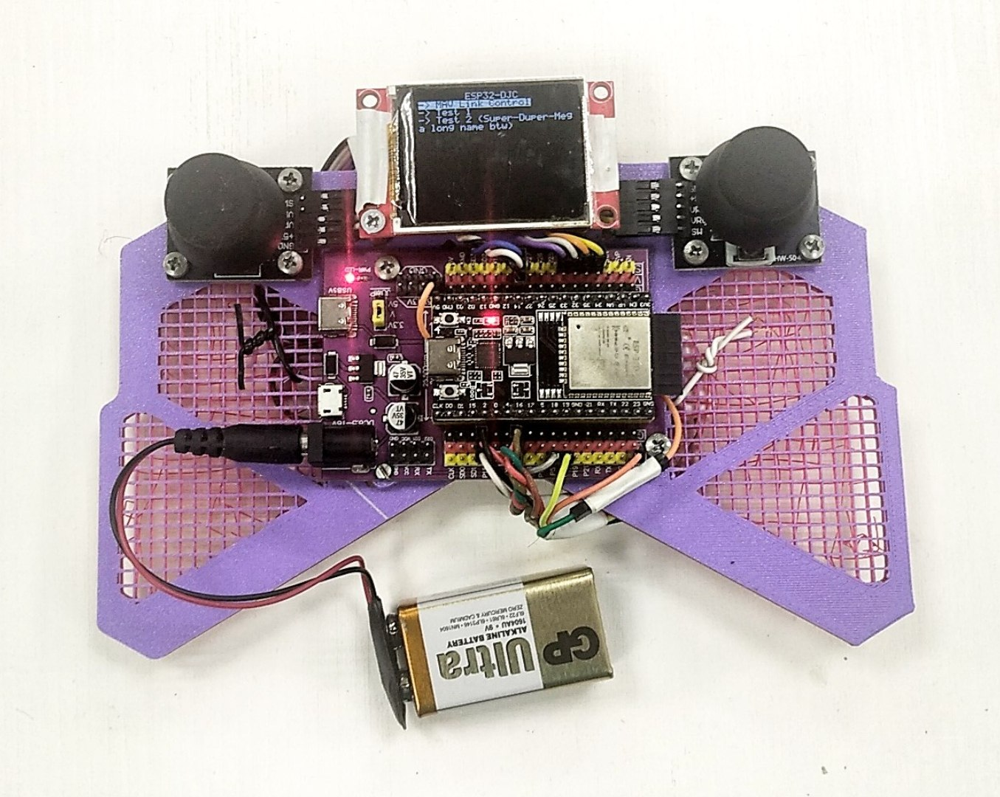
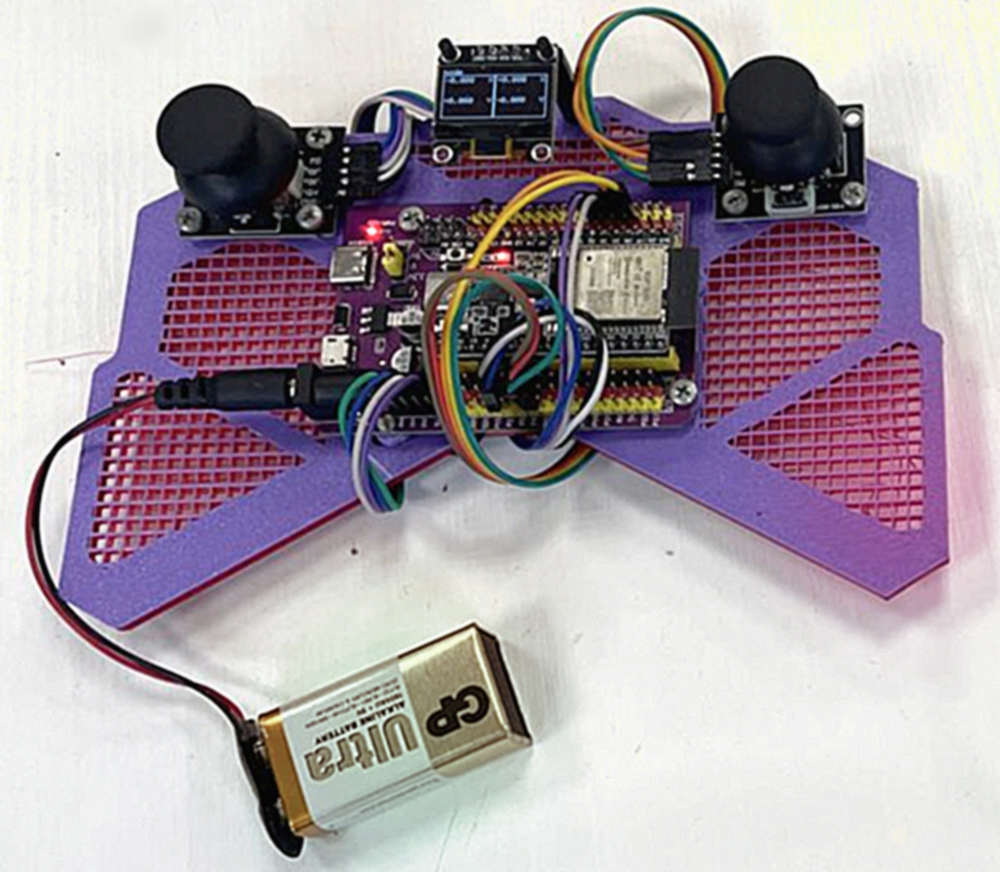

# ESP32 Dual Joystick Controller (DJC)

An open-source remote controller based on ESP32 with dual analog joysticks, designed for DIY robotics projects.



## Hardware

| Component     | Specification                                  | Notes                        |
|---------------|------------------------------------------------|------------------------------|
| MCU           | ESP32 (any DevKit variant)                     |                              |
| Joysticks     | 2x HW-504                                      | With integrated push-buttons |
| Display       | SSD1306 (128x64, I2C) or ST7735 (160x128, SPI) | Selectable via compile flag  |
| Communication | ESPNOW                                         | Direct ESP32-to-ESP32        |

### Pin Configuration

| Component | Name           | N | Pin   | ESP32-Pin |
|-----------|----------------|---|-------|-----------|
| HW-504    | Joystick       | 1 | GND   | GND       |
|           | (Left)         | 2 | +5V   | 3V3       |
|           |                | 3 | VRX   | GPIO 32   |
|           |                | 4 | VRY   | GPIO 33   |
|           |                | 5 | SW    | GPIO 14   |
|           |                |   |       |           |
| HW-504    | Joystick       | 1 | GND   | GND       |
|           | (Right)        | 2 | +5V   | 3V3       |
|           |                | 3 | VRX   | GPIO 35   |
|           |                | 4 | VRY   | GPIO 34   |
|           |                | 5 | SW    | GPIO 4    |
|           |                |   |       |           |
| SSD1306   | Display        | 1 | GND   | GND       |
|           | (128x64, I2C)  | 2 | VDD   | 3V3       |
|           |                | 3 | SDA   | GPIO 21   |
|           |                | 4 | SCK   | GPIO 22   |
|           |                |   |       |           |
| ST7735    | Display        | 1 | GND   | GND       |
|           | (160x128, SPI) | 2 | Reset | GPIO 15   |
|           |                | 3 | VCC   | 3V3       |
|           |                | 4 | DC    | GPIO 2    |
|           |                | 5 | CS    | GPIO 5    |
|           |                | 6 | SCK   | GPIO 18   |
|           |                | 7 | MOSI  | GPIO 23   |
|           |                | 8 | LED   | 5V        |

NOTE: ST7735 backlight LED requires a (220 + 220)Ω current-limiting resistors to 5V.

## Software

[DJC-Firmware](./DJC-Firmware) is a PlatformIO project. Configuration and dependencies are managed in [platformio.ini](./DJC-Firmware/platformio.ini).

This project uses [KiraFlux-Toolkit](https://github.com/KiraFlux/KiraFlux-Toolkit.git), included as a submodule in [/lib](./DJC-Firmware/lib).

To build:

1) Clone with submodules: `git clone --recursive https://github.com/KiraFlux/ESP32-DJC.git`
2) Open DJC-Firmware in Any IDE with PlatformIO support
3) Build and upload

### Firmware Structure

```
DJC-Firmware/src/
├── main.cpp              # Application entry point
└── djc/
    ├── Device.hpp        # Main device controller
    ├── Periphery.hpp     # Hardware abstraction
    ├── UI.hpp           # UI system configuration
    └── ui/              # Application pages
        ├── MainPage.hpp
        ├── MavLinkControlPage.hpp
        └── TestPage.hpp
```

### Implemented Features

| Feature              | Status  | Notes                          |
|----------------------|---------|--------------------------------|
| Dual joystick input  | Working | With calibration               |
| Display support      | Working | SSD1306 (I2C) and ST7735 (SPI) |
| ESPNOW communication | Working | Broadcast mode only            |
| Basic UI system      | Working | Page-based navigation          |
| MAVLink control      | Basic   | Manual control packets only    |

### Known Limitations

| Limitation      | Description                                                       |
|-----------------|-------------------------------------------------------------------|
| ESPNOW pairing  | Hardcoded to broadcast MAC                                        |
| MAVLink support | Minimal implementation (manual control + heartbeat + IMU receive) |
| Configuration   | No persistent storage                                             |
| Error handling  | Limited recovery mechanisms                                       |

### Development Status

The firmware is currently undergoing modernization as part of the [KiraFlux-Toolkit](https://github.com/KiraFlux/KiraFlux-Toolkit.git) update. Some components are in transition.

## Usage

### Controls

| Control              | Function                                                          |
|----------------------|-------------------------------------------------------------------|
| Left joystick button | Toggle navigation/control modes                                   |
| Right joystick       | Navigate UI (navigation mode) or send control data (control mode) |
| Right button         | Activate UI elements (navigation mode)                            |

### Modes

| Mode            | Description                                         |
|-----------------|-----------------------------------------------------|
| Navigation Mode | Right joystick controls UI menu navigation          |
| Control Mode    | Right joystick values are sent via ESPNOW / MAVLink |

## Models

The repository contains 3D models in native **Kompas 3D v23 Study** format:

| Directory                        | Contents              | Status                       |
|----------------------------------|-----------------------|------------------------------|
| [Models-Legacy](./Models-Legacy) | Original design files | Outdated, for reference only |
| [Models](./Models)               | Current models        | Minimal, under development   |

NOTE: Production-ready 3D printable models are not yet available.

## Images

| Original version with SSD1306 display      | Updated version with ST7735 display        |
|--------------------------------------------|--------------------------------------------|
|  |  |

## Contributing

Contributions are welcome. Please:

1. Report issues via GitHub Issues
2. Submit pull requests for improvements
3. Share your modifications in Discussions

## License

MIT License. See [LICENSE](./LICENSE) file for details.