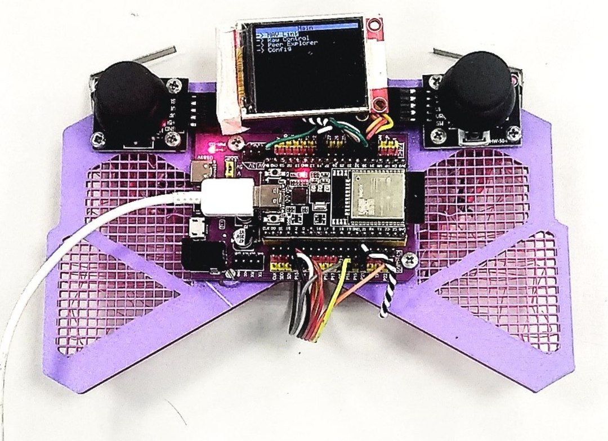
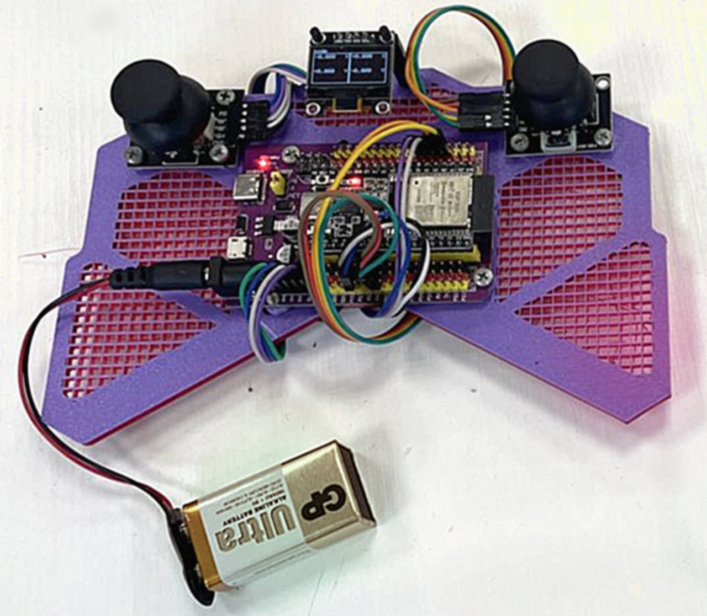
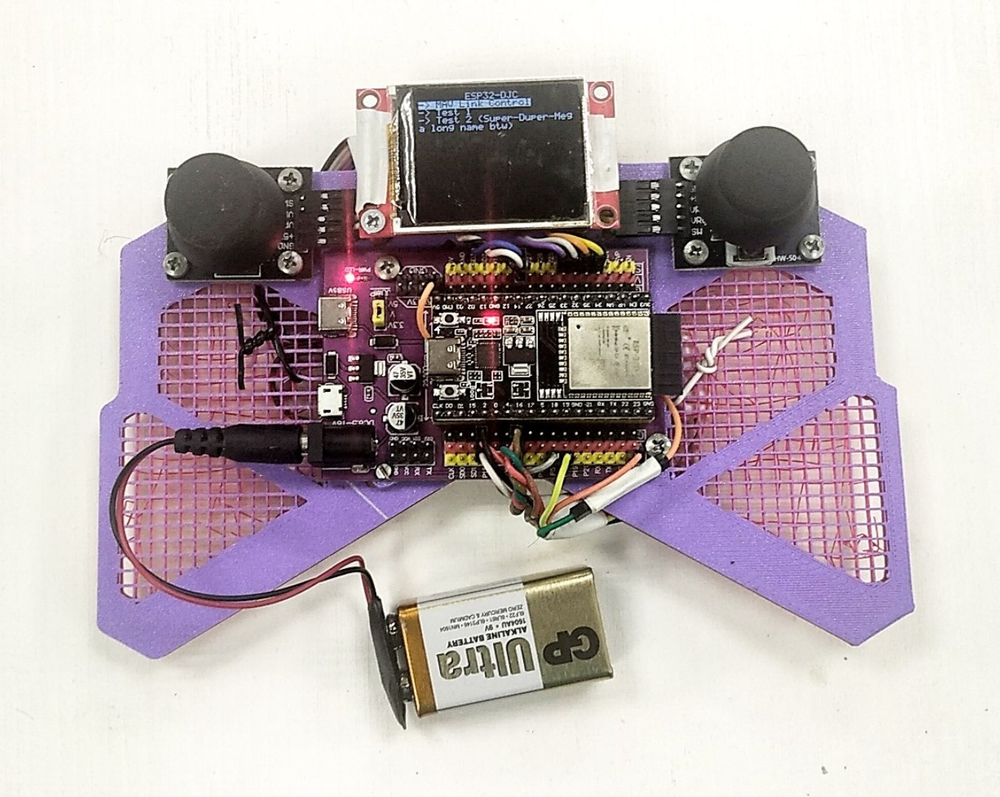
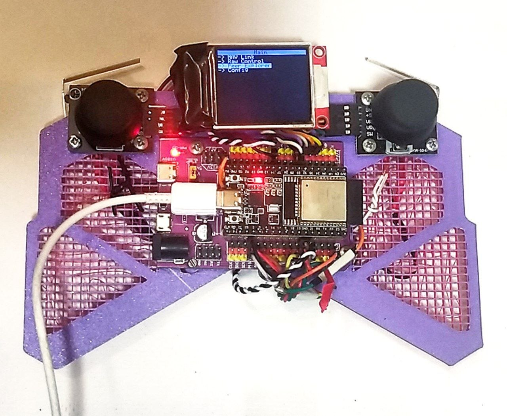

# ESP32 Dual Joystick Controller (DJC)

An open-source remote controller based on ESP32 with dual analog joysticks, designed for DIY robotics projects.

# Software

Firmware is a **PlatformIO** project located in the [`DJC-Firmware`](./DJC-Firmware) directory. All dependencies are declared and managed in [`platformio.ini`](./DJC-Firmware/platformio.ini).

The project uses:
- [KiraFlux/KiraFlux‑Toolkit](https://github.com/KiraFlux/KiraFlux-Toolkit.git)
- [okalachev/MAVLink](https://github.com/okalachev/MAVLink.git)

## Build

A [`makefile`](./DJC-Firmware/makefile) wraps common PlatformIO commands for convenience.

| Command      | Action                    | Note                            |
| ------------ | ------------------------- | :------------------------------ |
| `make`       | `pio run`                 | Compile the project             |
| `make u`     | `pio run --target upload` | Compile and upload to the ESP32 |
| `make m`     | `pio device monitor`      | Open serial monitor             |
| `make clean` | `pio run --target clean`  | Delete compiled objects         |

## Features

| Feature                                 | Status                                                             |
| --------------------------------------- | ------------------------------------------------------------------ |
| Dual joystick with calibration          | Implemented                                                        |
| ST7735 display (SPI)                    | Implemented                                                        |
| ESPNOW peer discovery & connection      | Implemented                                                        |
| Raw and MAVLink control modes           | Implemented (Basic)                                                |
| Persistent configuration (NVS)          | Implemented                                                        |
| MAVLink telemetry (partial)             | SCALED_IMU, ATTITUDE_QUATERNION, SERIAL_CONTROL messages supported |
| Peer explorer with signal age           | Implemented (shows last seen time)                                 |
| On‑screen text input (virtual keyboard) | Implemented (Basic)                                                |

## Usage

The device operates in three modes. Switching between UI Navigation and Control is done with the left button; Virtual Keyboard Input appears automatically when a text field is activated.

| Mode                       | Purpose                                | Activation                                                          |
| -------------------------- | -------------------------------------- | ------------------------------------------------------------------- |
| **UI Navigation**          | Menu navigation and widget interaction | Default after power‑on; return from Control by pressing left button |
| **Control**                | Transmit joystick data over ESPNOW     | Left button from UI Navigation                                      |
| **Virtual Keyboard Input** | Text entry                             | Automatically when a text field is activated                        |

### Input action by Mode

| Input             | UI Navigation                                 | Control (Raw)               | Control (MAVLink)           | Virtual Keyboard Input               |
| ----------------- | --------------------------------------------- | --------------------------- | --------------------------- | ------------------------------------ |
| **Left stick X**  | *Unused*                                      | `left_x`                    | `Yaw`                       | *Unused*                             |
| **Left stick Y**  | *Unused*                                      | `left_y`                    | `Thrust`                    | *Unused*                             |
| **Right stick X** | Change value of active widget (left/right)    | `right_x`                   | `Roll`                      | Move cursor horizontally on keyboard |
| **Right stick Y** | Move cursor between widgets (up/down)         | `right_y`                   | `Pitch`                     | Move cursor vertically on keyboard   |
| **Left button**   | Switch to **Control**                         | Return to **UI Navigation** | Return to **UI Navigation** | **Close virtual keyboard**           |
| **Right button**  | Activate selected widget (press, follow link) | *Ignored*                   | *Ignored*                   | **Enter the selected key**           |

<blockquote>

### Notes

- When the virtual keyboard is active, the left button closes it and does not switch modes.
- In Control mode, the right joystick does not affect the UI – all its movements are transmitted.

</blockquote>

## Known Limitations

- Only ST7735 display is currently supported
- MAVLink telemetry limited to basic IMU/attitude
- No CLI, no sleep

## Roadmap

The project roadmap is maintained in **GitHub Issues**.  
[View open issues and planned features](https://github.com/KiraFlux/ESP32-DJC/issues)

Click to see high‑level planned items

- Finalize power supply documentation
- KiCad schematic and single‑sided PCB shield
- Idle sleep for power saving
- Calibration visual feedback
- Custom peer names/aliases
- Extended MAVLink telemetry
- CLI over Serial
- SSD1306 support
- Hybrid storage (LittleFS + SD card)

---

# Hardware

## Components

| Group        | Component         | Part / Model        |  Qty  | Notes                                   |
| :----------- | :---------------- | :------------------ | :---: | :-------------------------------------- |
| **MCU**      | ESP32 DevKit      | ESP32‑WROOM‑32 (V4) |   1   | Any DevKit variant works                |
| **Power**    | Li‑ion cell       | 18650 1S1P          |   1   | Protected or unprotected (BMS required) |
|              | Boost converter   | XR2981 module       |   1   | Step‑up to 5V                           |
|              | Charger (planned) | TP4056 module       |   1   | With battery protection (DW01)          |
|              | Power switch      | KCD‑11‑2P           |   1   | Rocker switch                           |
| **Controls** | Joystick          | HW‑504              |   2   | Analog, 5V (works at 3.3V)              |
|              | Micro switch      | V‑153‑1C25 (NO)     |   2   | External button                         |
| **Display**  | TFT LCD           | ST7735 160×128 SPI  |   1   | With SD‑card slot                       |
| **Comm**     | Radio             | ESPNOW (integrated) |   –   | Direct ESP32‑to‑ESP32                   |

## Pin Configuration

| Name              | Component             |    № |   Pin | Board Network    |
| ----------------- | --------------------- | ---: | ----: | :--------------- |
| Joystick Left     | HW-504                |    1 |   GND | Devboard-GND     |
|                   |                       |    2 |   +5V | Devboard-3V3     |
|                   |                       |    3 |   VRX | Devboard-GPIO_32 |
|                   |                       |    4 |   VRY | Devboard-GPIO_33 |
|                   |                       |    5 |    SW | *NC*             |
|                   |                       |      |       |                  |
| Joystick Right    | HW-504                |    1 |   GND | Devboard-GND     |
|                   |                       |    2 |   +5V | Devboard-3V3     |
|                   |                       |    3 |   VRX | Devboard-GPIO_34 |
|                   |                       |    4 |   VRY | Devboard-GPIO_35 |
|                   |                       |    5 |    SW | *NC*             |
|                   |                       |      |       |                  |
| Button Left       | V-153-1C25            |    1 |   COM | Devboard-GND     |
|                   |                       |    2 |    NO | Devboard-GPIO_14 |
|                   |                       |    3 |    NC | *NC*             |
|                   |                       |      |       |                  |
| Button Right      | V-153-1C25            |    1 |   COM | Devboard-GND     |
|                   |                       |    2 |    NO | Devboard-GPIO_4  |
|                   |                       |    3 |    NC | *NC*             |
|                   |                       |      |       |                  |
| Display           | ST7735                |    1 |   LED | Devboard-5V      |
|                   | (Module SPI 160x128)  |    2 |   SCK | Devboard-GPIO_18 |
|                   |                       |    3 |  MOSI | Devboard-GPIO_23 |
|                   |                       |    4 |    DC | Devboard-GPIO_22 |
|                   |                       |    5 | Reset | Devboard-GPIO_17 |
|                   |                       |    6 |    CS | Devboard-GPIO_5  |
|                   |                       |    7 |   GND | Devboard-GND     |
|                   |                       |    8 |   VCC | Devboard-3V3     |
|                   |                       |      |       |                  |
| Power Switch      | KCD-11-2P             |    1 |   COM | B+               |
|                   |                       |    2 |    NO | PowerSwitch-NO   |
|                   |                       |      |       |                  |
| Voltage Converter | XR2981                | X1-1 |  OUT+ | Devboard-5V      |
|                   | (Step-up Module)      | X1-2 |  OUT- | Devboard-GND     |
|                   |                       | X2-1 |   IN+ | PowerSwitch-NO   |
|                   |                       | X2-2 |   IN- | B-               |
|                   |                       |      |       |                  |
| Battery Sense     | Resistor R1 (100 kΩ)  |    1 |     – | PowerSwitch‑NO   |
|                   |                       |    2 |     – | Devboard‑GPIO_36 |
|                   | Resistor R2 (33 kΩ)   |    1 |     – | Devboard‑GPIO_36 |
|                   |                       |    2 |     – | Devboard‑GND     |
|                   | Capacitor C1 (0.1 µF) |    1 |     – | Devboard‑GPIO_36 |
|                   |                       |    2 |     – | Devboard‑GND     |

<blockquote>    

### NOTE

*NC* means *Not Connected*

Devboard means ESP32 Devkit v4 prototyping board

ST7735 backlight LED **requires** a current‑limiting resistor (440Ω, e.g., two 220Ω in series) when powered from 5V.

Buttons are external micro switches `NO` (normally open) connected between GND and the respective GPIO. Internal pull‑ups are enabled in firmware.

B+ and B- denote battery contacts

</blockquote>

## ESP32 Pin Status

| Left Header | Status | Project Assignment      | Right Header | Status | Project Assignment                |
| ----------: | :----: | :---------------------- | -----------: | :----: | :-------------------------------- |
|     **3V3** |   ✓    | Logic power             |      **GND** |   ✓    | Common ground                     |
|      **EN** |   ✓    | Reset (EN button)       |   **GPIO23** |   ✓    | SPI MOSI (display + SD)           |
| **GPIO 36** |   ✓    | Battery voltage divider |  **GPIO 22** |   ✓    | Display DC                        |
| **GPIO 39** |   ○    | *Free (input only)*     |   **GPIO 1** |   ✓    | UART0 TX (Serial debug)           |
| **GPIO 34** |   ✓    | Right joystick X        |   **GPIO 3** |   ✓    | UART0 RX (Serial debug)           |
| **GPIO 35** |   ✓    | Right joystick Y        |  **GPIO 21** |   ○    | *Free (reserved for I2C SDA)*     |
| **GPIO 32** |   ✓    | Left joystick X         |  **GPIO 19** |   ✓    | *SPI MISO (SD card)*              |
| **GPIO 33** |   ✓    | Left joystick Y         |  **GPIO 18** |   ✓    | SPI SCK (display + SD)            |
| **GPIO 25** |   ○    | *Free (DAC)*            |   **GPIO 5** |   ✓    | SPI CS (display)                  |
| **GPIO 26** |   ○    | *Free (DAC)*            |  **GPIO 17** |   ✓    | Display RESET                     |
| **GPIO 27** |   ○    | *Free*                  |  **GPIO 16** |   ✓    | *SPI CS (SD card)*                |
| **GPIO 14** |   ✓    | Left button             |   **GPIO 4** |   ✓    | Right button                      |
| **GPIO 12** |   ✗    | *Avoid (MTDI)*          |   **GPIO 0** |   ✓    | BOOT button (use with caution)    |
|     **GND** |   ✓    | Common ground           |   **GPIO 2** |   ○    | *Free (strapping, use with care)* |
|     **VIN** |   ✓    | 5V input (from XR2981)  |  **GPIO 15** |   ○    | *Free (strapping, use with care)* |

<blockquote>

### Legend

| Symbol | Meaning         | Note                                         |
| :----: | --------------- | :------------------------------------------- |
|   ✓    | **Occupied**    | Already used in the project or reserved      |
|   ○    | **Free**        | Available for new components                 |
|   ✗    | **Unavailable** | **Not** recommended for use (boot conflicts) |

### Notes

|   Feature | Used pins             | Note                                                                   |
| --------: | :-------------------- | ---------------------------------------------------------------------- |
|      MTDI | **GPIO 12**           | controls flash voltage at startup; using it may cause boot instability |
|     UART0 | **GPIO 1 / GPIO 3**   | Serial                                                                 |
|      BOOT | **GPIO 0**            | It can be used as GPIO if held high at boot.                           |
|           | **GPIO 39**           | input-only and lacks an internal pull‑up resistor                      |
|       DAC | **GPIO 25 / GPIO 26** | Can be used as DAC outputs                                             |
| Strapping | **GPIO 2 / GPIO 15**  | Freed in this design; safe to use with care (must be low at boot)      |

</blockquote>

## Models

3D models (Kompas 3D format) are located in `Models-Legacy` (outdated) and `Models` (under development).  
No production‑ready files yet.

## Backlog

<blockquote>

## v0.1.x

| `v0.1.0` (SSD1306 display)                                              | `v0.1.1` (Using ST7735 display)                                         |
| ----------------------------------------------------------------------- | ----------------------------------------------------------------------- |
|  |  |

## v0.2.x

| `v0.2.0` (Add microswitch buttons)                                      | `v0.2.1` (Improved cable management)                                    |
| ----------------------------------------------------------------------- | ----------------------------------------------------------------------- |
|  |  |

</blockquote>

---

## License

This project is licensed under the **GNU General Public License v3.0 or later** (SPDX: `GPL-3.0-or-later`).

See the [LICENSE](LICENSE) file for the full text.